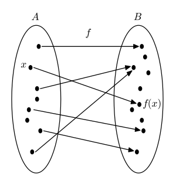
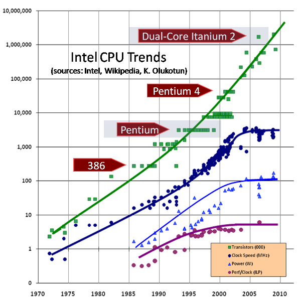
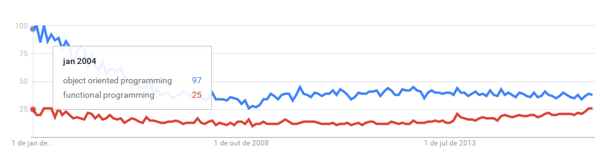
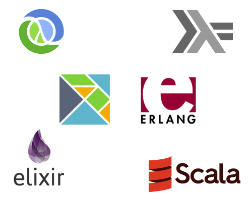

#HSLIDE

# Introdução à Programação Funcional
<link rel="stylesheet" type="text/css" href="https://fonts.googleapis.com/css?family=Ubuntu+Mono">

#HSLIDE

## Escopo dessa apresentação:

- imutabilidade, funções puras, concorrência e paralelismo
- programação funcional e o contexto histórico
- programação funcional e a orientação a objetos
- exemplos com código (pouco)

#HSLIDE

## Funcional porque só usa funções?

**`funcional != procedural`** <!-- .element: class="fragment" -->

#HSLIDE

## Alguns conceitos básicos importantes:

- função (matemática)
- função pura
- imutabilidade
- função como argumento para outra função

#HSLIDE

## Lembra daquela aula de matemática?

 <!-- .element: class="fragment" -->

#HSLIDE

## Algo entra, algo é retornado

 <!-- .element: class="fragment" -->

#HSLIDE

## Imutabilidade

**Esqueça coisas como:**

- `x++`
- `x = x + 1`
- `x += 1`

#HSLIDE

## Funções puras

- **sempre** retornam o mesmo resultado para um mesmo argumento
- não dependem de informação interna oculta ou estado
- não alteram nada ao seu redor (sem *side effects*)

#HSLIDE

## Pura ou impura?

Consegue enxergar pontos negativos?

```javascript

function oneMinuteAhead() {

    now = new Date();
    now.setMinutes(now.getMinutes() + 1);
    return now;

}

```

#HSLIDE

## E agora, que tal?

```javascript

function oneMinuteAhead(date) {

    return new Date(date.getYear(),
                    date.getMonth(),
                    date.getDay(),
                    date.getHour(),
                    date.getMinutes() + 1,
                    date.getSeconds(),
                    date.getMilliseconds());

}

```

#HSLIDE

## Você faz ou já fez assim:

```javascript

var numbers = [1, 3, 5, 10, 15];
var result = [];

for(var i = 0; i < numbers.length; i++) {
    if (numbers[i] > 5) {
        result.push(numbers[i]);
    }
}

console.log(result);

```

#HSLIDE

## Função que recebe função

```javascript

var numbers = [1, 3, 5, 10, 15];

const biggerThanFive = number => { return number > 5 };

console.log(numbers.filter(biggerThanFive));

```

#HSLIDE

## Ok, e por que todo esse hype? Tudo isso é modinha, vai passar!

### Será? Vamos voltar no tempo... <!-- .element: class="fragment" -->

#HSLIDE

## The Free Lunch Is Over: A Fundamental Turn Toward Concurrency in Software (2004)

> "Concurrency is the next major revolution in how we write software"

#HSLIDE



#HSLIDE

## Conceitos que são confundidos frequentemente

- **Concorrência**: 2 tarefas iniciadas, mas **concorrem** pelo uso do processador (um ou outro, com alternância)
- **Paralelismo**: 2 tarefas iniciadas, executadas literalmente ao mesmo tempo (processador multi core)

#HSLIDE

Imagine 2 threads em paralelo operando sobre **o mesmo endereço de memória**...

Lembrou daquele monte de x = x + 1 ? E se os dados fossem imutáveis?! <!-- .element: class="fragment" -->

 <!-- .element: class="fragment" -->

#HSLIDE

## Faz sentido, mas por que só agora?

#HSLIDE

## Voltando no tempo

- 1958: Lisp
- Memória com custo altíssimo

#HSLIDE

## Orientação a objetos é a solução para os seus problemas!

#HSLIDE

**Google Trends**



#HSLIDE

## Qual é melhor?

## Imperativo ou declarativo? <!-- .element: class="fragment" -->

#HSLIDE

## E agora, que caminho escolher?



#HSLIDE

## Dúvidas?
